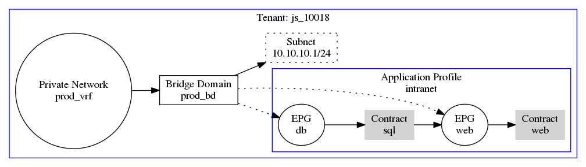

# Exemplos de Configuração do ACI com Terraform
Mantido por [Taígo](https://github.com/taigorene).

Usado como referencia os materiais do [PeteFurniss - Terraform ACI CookBook](https://github.com/PeteFurniss/TerraformACICookbook).

*Repositório em desenvolvimento e estudo contínuo!*

## Como usar

Clone o repo:
```
# git clone hhttps://github.com/taigorene/aws_infra-tf.git
```

Configure as variáveis como citado em [Notas](#notas), e então basta executar os comandos:
```
# terraform init

# terraform apply
```

## Notas
No repositório local, é preciso criar um arquivo com as variáveis que são sensíveis. Exemplo:

Nome: `terraform.tfvars`.

``` json
user = {
    username = "user"
    password = "pass"
    url = "https://url-do-aci.com.br"
}
```

Caso use o [Terraform Cloud](https://cloud.hashicorp.com/products/terraform), configure as variais sensíveis no [workspace](https://www.terraform.io/cloud-docs/workspaces/variables).

## Topologia

A Configuração localizada no diretório raiz deve subir esses componentes (*ainda em desenvolvimento*):


*Fonte: Cisco DevNet*

**Bom estudo e desenvolvimento!** :smile: